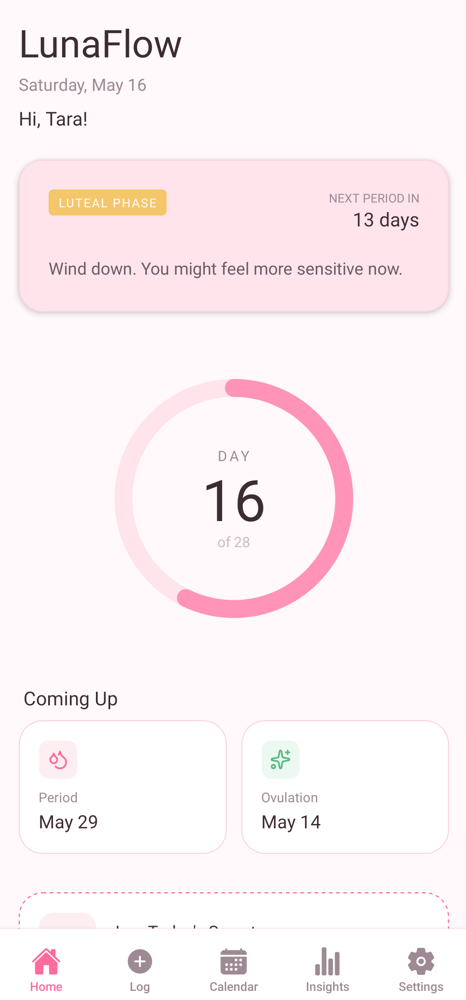
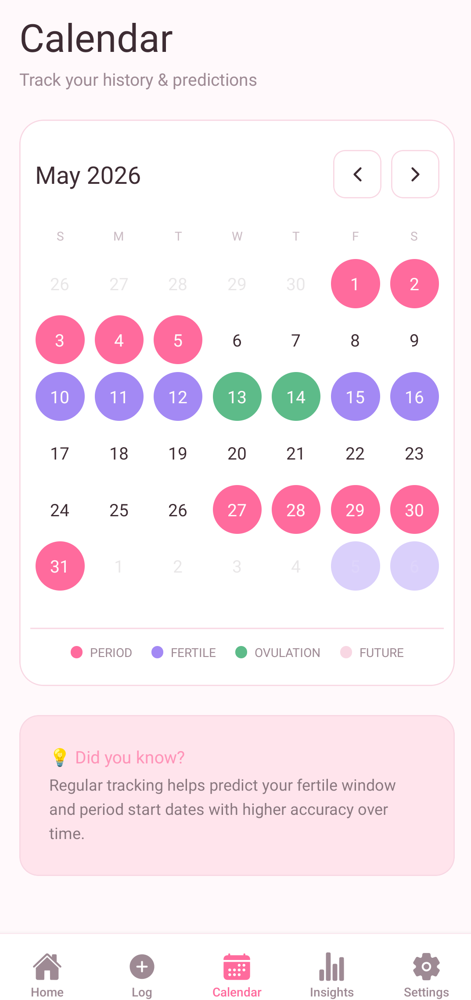
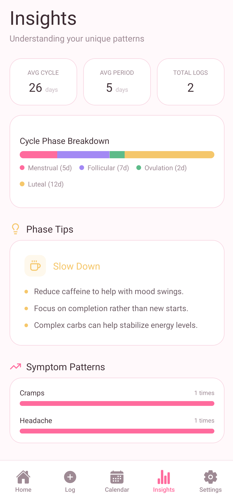
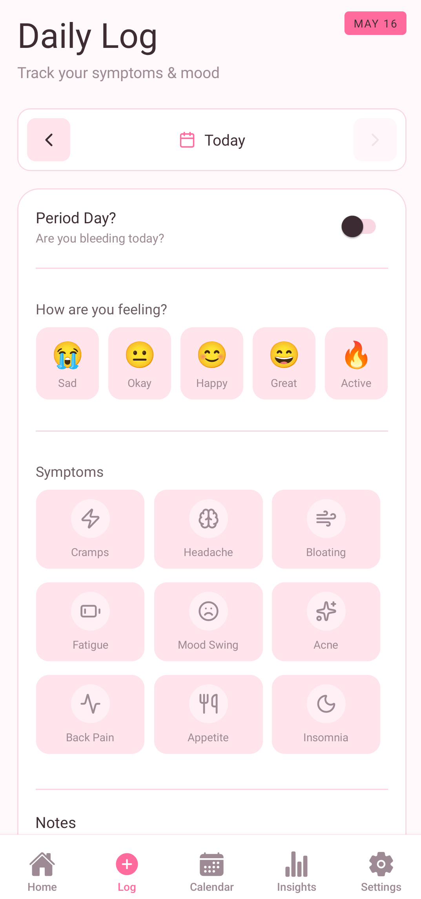
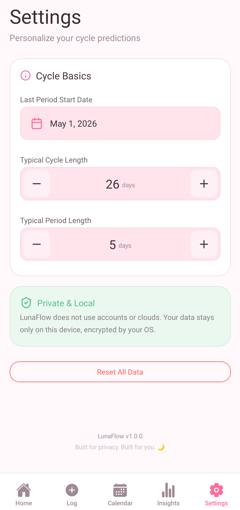

# 🌙 LunaFlow - Track Your Cycle with Clarity & Comfort

<div align="center">

**A Modern Period Tracking Application Built with React & Vite**

[](https://github.com/blitzbugg/luna-flow)
[](https://github.com/blitzbugg/luna-flow/releases)
[](https://react.dev)
[](https://vitejs.dev)
[](https://tailwindcss.com)

</div>

---

## ✨ What is LunaFlow?

LunaFlow is a **privacy-first period tracking application** designed to empower users with insights into their menstrual cycle, mood patterns, and overall wellness. With an elegant, intuitive interface and zero data collection, LunaFlow puts **your privacy first** while giving you complete control over your health data.

---

## 🎯 Key Features

- 📅 **Smart Cycle Tracking** - Predict your next period with advanced algorithms
- 🎭 **Mood & Wellness Logging** - Track your emotional and physical well-being
- 📊 **Detailed Insights** - Visualize patterns and trends in your cycle data
- 🔒 **Complete Privacy** - Your data stays on your device, no cloud sync, no tracking
- 🎨 **Beautiful Design** - Modern, user-friendly interface with smooth animations
- ⚡ **Lightning Fast** - Built with React + Vite for optimal performance
- 📱 **Mobile First** - Fully responsive design for smartphones and tablets

---

## 📸 Explore the App

### 🏠 Home Screen
Welcoming dashboard with quick access to all your tracking features and today's information.



### 📅 Calendar View
Beautiful calendar interface to visualize your cycle patterns and important dates at a glance.



### 📊 Insights & Analytics
Deep dive into your wellness data with comprehensive analytics and cycle predictions.



### 📝 Activity Log
Complete history of all your entries with detailed mood and symptom logs.



### ⚙️ Personalized Settings
Customize your experience with flexible preferences and notification settings.



---

## 🚀 Quick Start

### Prerequisites
- Node.js 16+ 
- npm or yarn

### Installation

```bash
# Clone the repository
git clone https://github.com/blitzbugg/luna-flow.git
cd luna-flow

# Install dependencies
npm install

# Start development server
npm run dev

# Build for production
npm run build
```

The app will be available at `http://localhost:5173`

---

## 🛠️ Tech Stack

- **Frontend Framework** - React 19.2
- **Build Tool** - Vite 8.0
- **Styling** - Tailwind CSS 4.3 + @tailwindcss/vite
- **Animations** - Framer Motion 12.38
- **Icons** - Lucide React 1.16
- **Linting** - ESLint 10+

---

## 📦 Available Scripts

```bash
# Development server with hot reload
npm run dev

# Build for production
npm run build

# Preview production build locally
npm run preview

# Run ESLint
npm run lint
```

---

## 🔐 Privacy Promise

At LunaFlow, your privacy is sacred. We believe your health data is deeply personal and should remain yours alone.

✅ **No cloud storage** - All data stays on your device
✅ **No tracking** - We don't collect any analytics or telemetry
✅ **No ads** - Pure, clean experience without advertisements
✅ **Open source** - Code transparency for complete trust

---

## 📥 Download

Get LunaFlow on your device:

- 📱 **Android** - [Download APK v1.0.1](https://github.com/blitzbugg/luna-flow/releases/download/v1.0.1/LunaFlow-v1.0.1.apk)
- 🔗 **GitHub** - [View Source Code](https://github.com/blitzbugg/luna-flow)

---

## 🤝 Contributing

Contributions are welcome! Feel free to:
- Report bugs and request features via GitHub Issues
- Submit pull requests with improvements
- Help improve documentation
- Share feedback and suggestions

---

## 📄 License

This project is open source. Check the LICENSE file for details.

---

## 💬 Support & Feedback

Have questions or suggestions? We'd love to hear from you!
- **GitHub Issues**: [Report an issue](https://github.com/blitzbugg/luna-flow/issues)
- **Discussions**: [Join the conversation](https://github.com/blitzbugg/luna-flow/discussions)

---

<div align="center">

### Made with 💜 for your wellness

**LunaFlow v1.0.1** - Track with clarity, live with comfort.

[⬆ Back to top](#-lunaflow---track-your-cycle-with-clarity--comfort)

</div>
